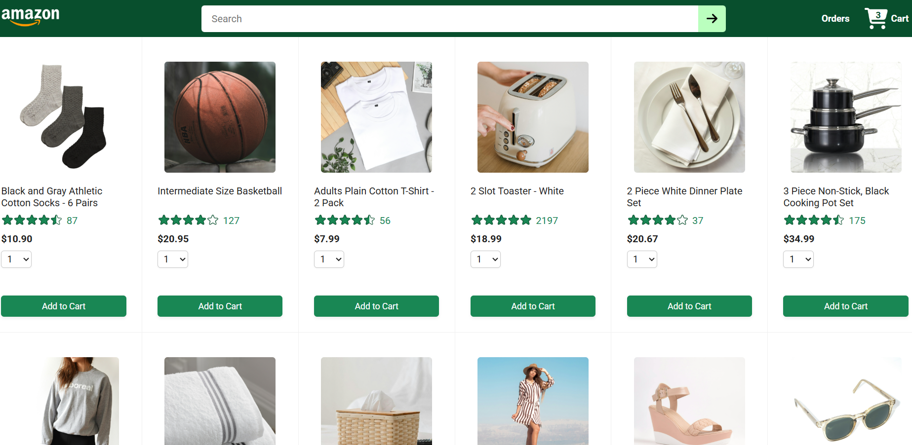
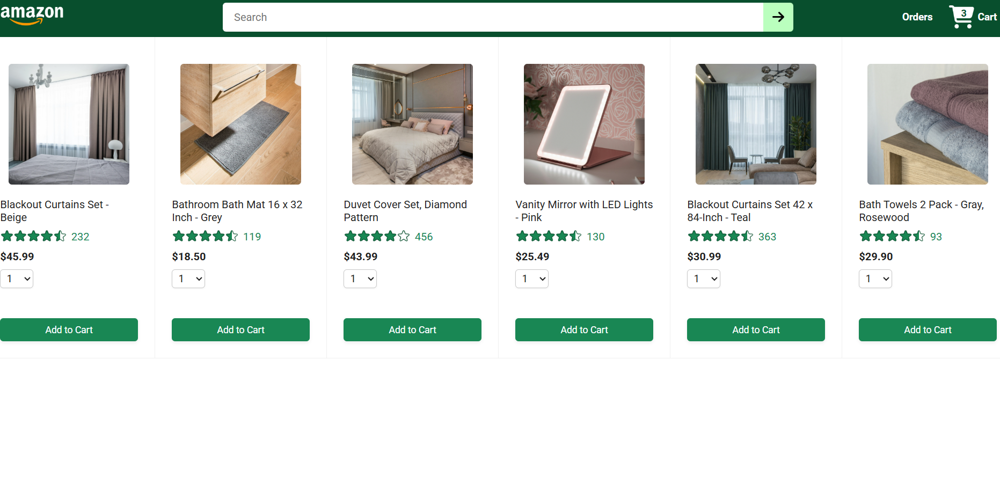
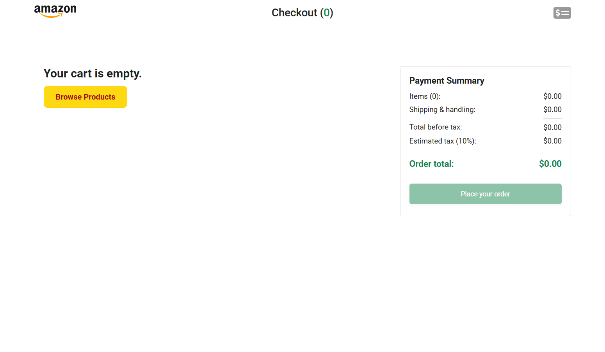
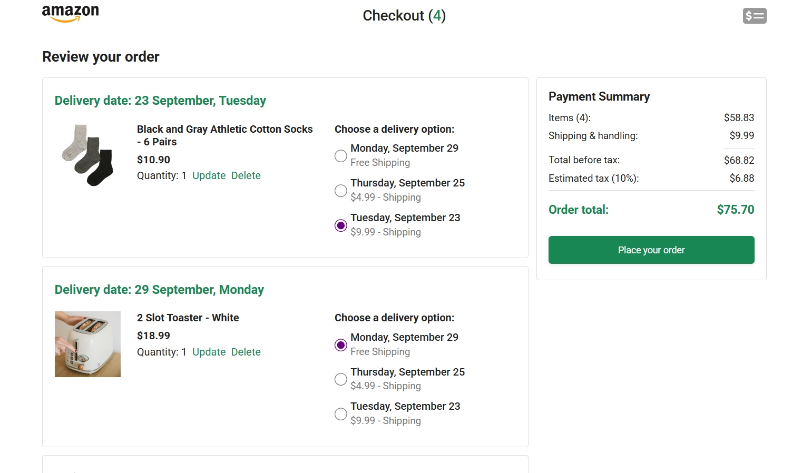
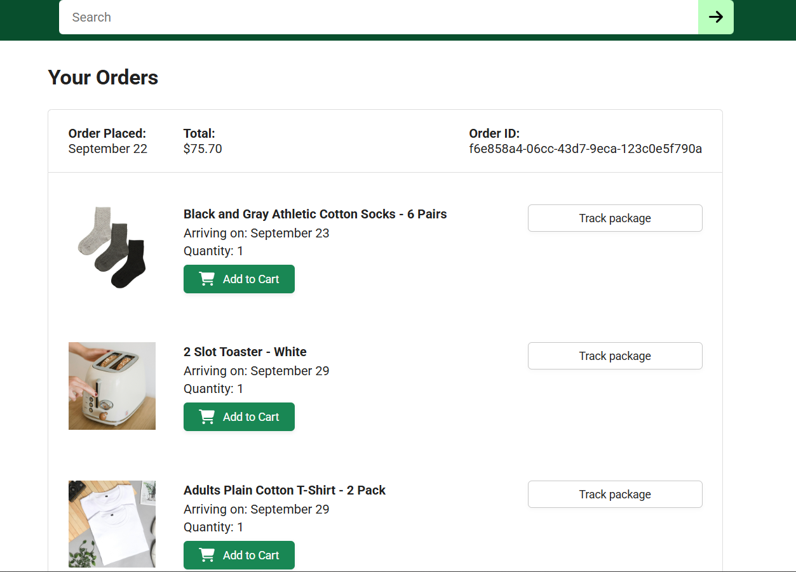
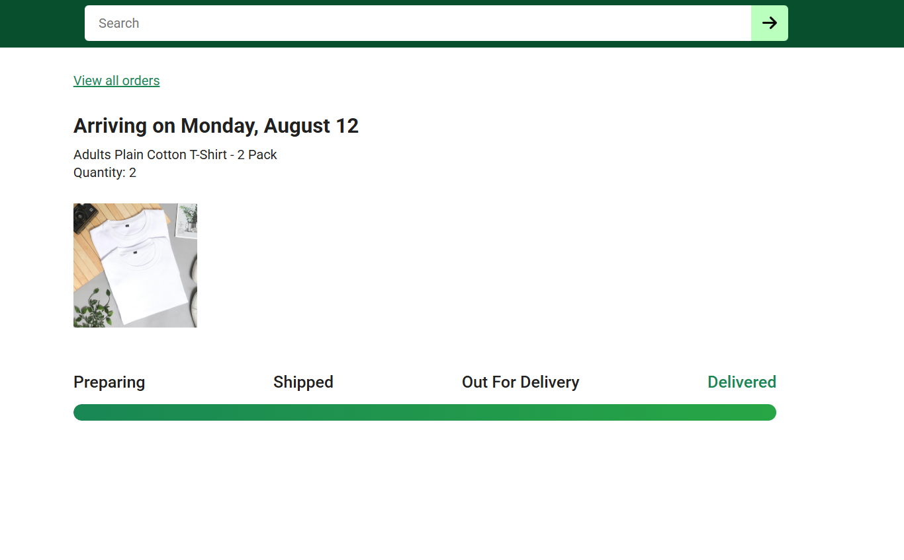

# 🛒 E-commerce React Clone

A responsive **E-commerce clone website** built with **React, Vite, and JavaScript**, replicating the look and feel of a modern online store.

---

## Live Demo

🔗 [http://react-proj-ecommerce-cl.netlify.app](http://react-proj-ecommerce-cl.netlify.app)

---

## 📌 Features

- 🖥️ Multi-page layout (Home, Cart, Checkout, Orders, etc.)
- 🎨 Fully responsive design for desktop & mobile
- 🔍 Search bar, product cards, and navigation bar
- 🛍️ Add to Cart, Update Quantity, Remove from Cart
- 📦 Delivery options selection in Checkout page
- 💳 Payment summary and Orders page
- ⚡ Smooth UI with state management using React Context API

---

## 🛠️ Tech Stack

- **React.js** – Frontend framework
- **Vite** – Build tool & development server
- **CSS3 / Flexbox / Grid** – Styling & responsive layout
- **Axios** – API requests to backend
- **React Router** – Client-side routing
- **React Context API** – State management

---

## 🔧 Backend API

Here’s a list of all the URL paths you can use with this backend and what each URL does.

### 🛍️ Products & Delivery Options

| Method | Endpoint                | Description                      |
| ------ | ----------------------- | -------------------------------- |
| GET    | `/api/products`         | Fetch all products               |
| GET    | `/api/delivery-options` | Fetch available delivery options |

### 🛒 Cart

| Method | Endpoint                     | Description                                       |
| ------ | ---------------------------- | ------------------------------------------------- |
| GET    | `/api/cart-items`            | Fetch all cart items                              |
| POST   | `/api/cart-items`            | Add a new item to the cart                        |
| PUT    | `/api/cart-items/:productId` | Update quantity or delivery option of a cart item |
| DELETE | `/api/cart-items/:productId` | Remove an item from the cart                      |

### 📦 Orders

| Method | Endpoint               | Description                |
| ------ | ---------------------- | -------------------------- |
| GET    | `/api/orders`          | Fetch all orders           |
| POST   | `/api/orders`          | Place a new order          |
| GET    | `/api/orders/:orderId` | Fetch a single order by ID |

### 💳 Payment Summary & Reset

| Method | Endpoint               | Description                                            |
| ------ | ---------------------- | ------------------------------------------------------ |
| GET    | `/api/payment-summary` | Fetch the current payment summary (total, taxes, etc.) |
| POST   | `/api/reset`           | Reset cart and orders (useful for testing/demo)        |

---

## 📸 Project Screenshots

### 🏠 Homepage

### 🔍 Search Products

### 🛒 Empty Cart

### 🛍️ Cart with Products / Checkout Page

### 💳 Orders Page

### 🚚 Delivery Options Selection

### 🛤️ Tracking Page

## 
